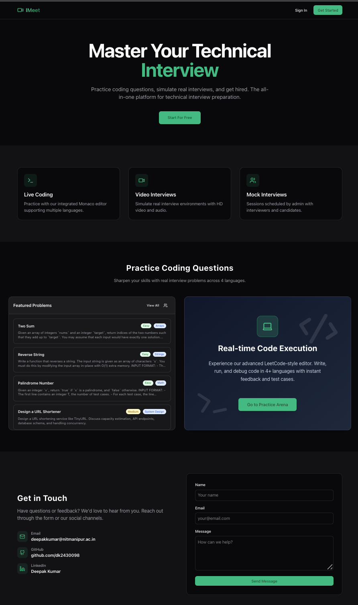
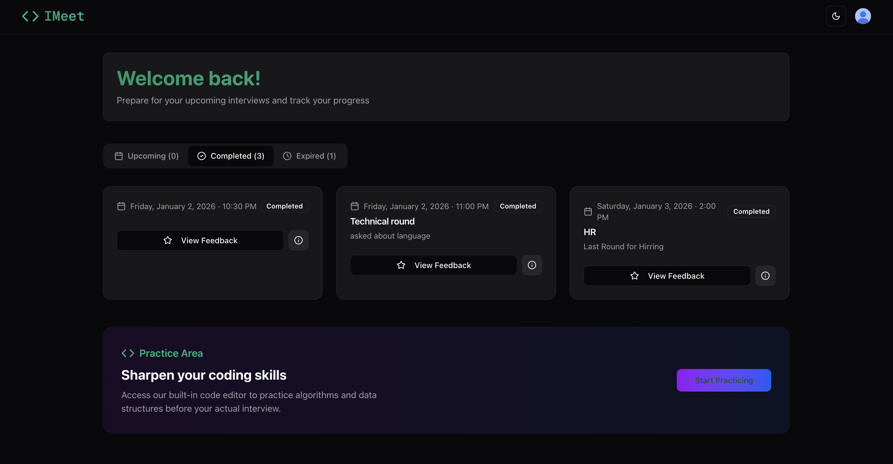
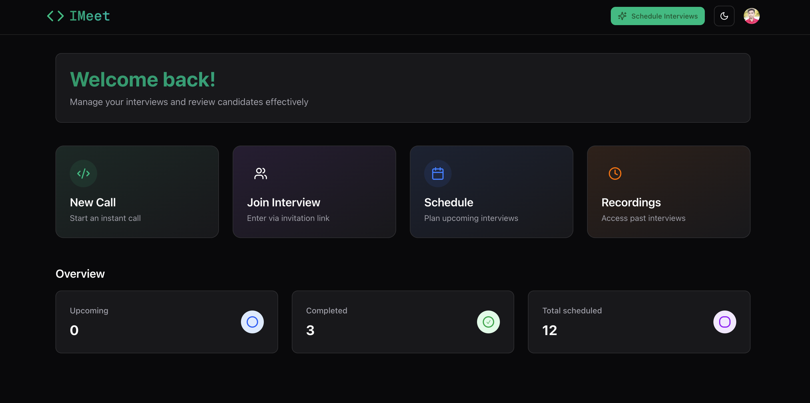
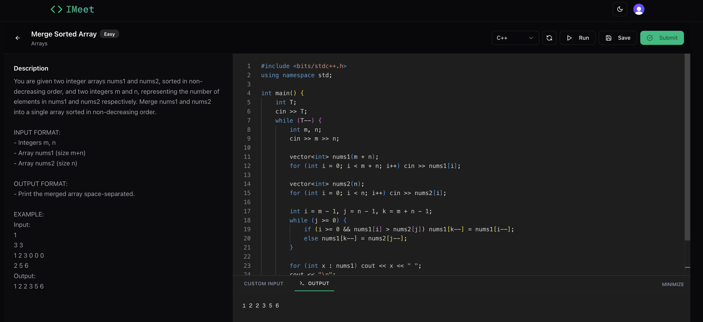
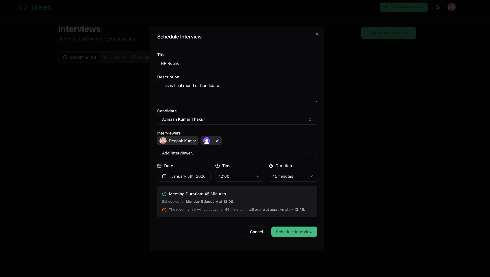

# 🚀 IMeet

**A Real-Time Technical Interview Platform**

IMeet is a comprehensive platform designed to streamline the technical interview process. It combines high-quality video conferencing, a collaborative real-time code editor, and a hybrid practice problem system into a single, cohesive interface.

[](https://i-meet-73tv.vercel.app/)
[](https://github.com/dk2430098/IMeet)


---

### 🧐 Project Context
*   **Why I started IMeet**: To address the fragmentation in technical interviews where candidates and interviewers often juggle between Zoom, a code sandbox, and Google Docs. IMeet unifies these tools.
*   **The Problem**: Traditional tools lack synchronization. IMeet solves this by offering low-latency state sharing for both code and video.
*   **Intent**: Built as a **Learning-Oriented** project that evolved into a production-grade robust application, focusing on mastery of modern web sockets and state standards.

---

### ✨ Features
*   **Real-time Video & Audio**: HD video calls powered by Stream.
*   **Collaborative Code Editor**: Multi-language support with live cursor tracking.
*   **Screen Sharing**: Seamless screen sharing for system design discussions.
*   **Practice Area**: A collection of coding challenges (Internal & Codeforces API).
*   **Interview Scheduling**: Integrated calendar and booking system.
*   **Recording & Playback**: Review past interviews for feedback.

#### 👥 User Roles
*   **Candidate**: Access Schedule, Join Meetings, Practice Problems, View Dashboard stats.
*   **Interviewer**: Create Meetings, Review Candidates, Manage Schedules, "End Meeting for All" controls.
*   **Admin**: (Future Scope) User management and platform analytics.

---

### 🛠 Tech Stack

*   **Frontend**: Next.js 14+ (App Router)
    *   *Why?* For its robust server-side rendering, easy routing, and React Server Components efficiency.
*   **Real-time Backend**: Convex
    *   *Why?* Replaces complex WebSocket setups with a reactive database that pushes state updates to the client instantly.
*   **Authentication**: Clerk
    *   *Why?* Secure, battle-tested user management with extensive middleware protection.
*   **Videoencing**: Stream Video SDK
    *   *Why?* Low-latency global edge network for reliable video calls without managing WebRTC servers.
*   **Code Execution**: Judge0 / Piston (via API)
    *   *Why?* Sandboxed, secure environment to run untrusted code in multiple languages.
*   **Styling**: TailwindCSS & Shadcn/UI
    *   *Why?* Rapid UI development with accessible, professionally designed components.

---

### 🏗 System Architecture

#### 📂 Folder Structure Overview
*   `app/`: Main application routes (Pages, Layouts, API endpoints).
*   `components/`: Reusable UI components (MeetingRoom, Controls, Forms).
*   `convex/`: Backend logic, database schemas, and real-time functions.
*   `lib/`: Utility functions (Date formatting, Helpers).
*   `public/`: Static assets (Images, Icons).
*   `hooks/`: Custom React hooks for logic reuse.

---

### 🔄 Project Flow

1.  **Auth**: User logs in via Clerk.
2.  **Dashboard**: User enters as Candidate or Interviewer.
3.  **Scheduling**: Interviewer sets a time; Candidate accepts.
4.  **Meeting**: Both join a Room ID. Video/Audio connects.
5.  **Coding**: Changes in Editor perform optimistic updates to Convex, syncing instantly.
6.  **Completion**: Meeting ended, recording processed and saved.

#### 🧩 Practice Problem System (Hybrid Model)
*   **Internal Problems**: Curated list stored in Convex DB for reliability.
*   **External Problems**: Fetches directly from Codeforces API to provide an endless supply of challenges.
*   **Why Hybrid?**: Ensures core availability (internal) while offering variety (external).

---

### 🔐 Environment Variables

**Security Notes**:
*   `NEXT_PUBLIC_` variables are exposed to the browser.
*   `CLERK_SECRET_KEY` and `STREAM_SECRET_KEY` are **never** exposed and sit strictly on the server/backend.

Create a `.env.local` file:
```bash
NEXT_PUBLIC_CONVEX_URL=...
NEXT_PUBLIC_CLERK_PUBLISHABLE_KEY=...
CLERK_SECRET_KEY=...
NEXT_PUBLIC_STREAM_API_KEY=...
STREAM_SECRET_KEY=...
NEXT_PUBLIC_FORMSPREE_URL=...
```

---

### 🚀 Installation & Setup

1.  **Clone the repo**:
    ```bash
    git clone https://github.com/dk2430098/IMeet.git
    cd IMeet
    ```
2.  **Install dependencies**:
    ```bash
    npm install
    ```
3.  **Setup Environment**:
    Fill in your `.env.local` with keys from Clerk, Convex, and Stream.
4.  **Run Development Server**:
    ```bash
    npm run dev
    ```
5.  **Start Backend**:
    ```bash
    npx convex dev
    ```

#### ☁️ Deployment Notes
*   **Frontend**: Deployed on Vercel (Auto-detects Next.js).
*   **Backend**: Convex managed backend (Auto-deploys with simple configuration).
*   **Issue**: Ensure Environment Variables are set in the Vercel Dashboard project settings.

---

### 📸 Screenshots

### Landing Page


### Dashboard (Candidate View)


### Dashboard (Interviewer View)


### Meeting Room (Video & Code)


### Practice Area


### Scheduling Interface


#### ⚠️ Known Limitations
*   **Free Tier**: Stream Video has monthly minute caps. Convex has database bandwidth limits.
*   **Code Execution**: Judge0 public API has rate limits (might delay output on heavy load).
*   **Mobile**: Optimized for Tablet/Desktop; Mobile experience is view-only focus.

---

### 🔮 Future Improvements

*   **Whiteboard**: Add an Infinite Canvas for drawing system architecture.
*   **AI Interviewer**: Integrate LLMs to ask follow-up questions to the candidate.
*   **Analytics**: Detailed breakdown of code efficiency (Big O notation analysis).

#### ♻️ Refactor Ideas
*   Move some client-side calculations to Convex Actions for better performance.
*   Standardize all "Card" components to a single variant.

---

### 🤝 Contribution

Contributions are welcome! Please fork the repo and create a Pull Request.

---

### 🎓 Learning Outcomes
*   **Technical**: Mastered `useQuery` and `useMutation` patterns for optimistic UI.
*   **System Design**: Understood the trade-offs between WebSockets (Socket.io) and Reactive HTTP (Convex).
*   **Architecture**: Built a modular, component-driven UI that separates concerns effectively.

---

### 📝 Personal Notes (For Future Me)
*   *Decision*: Choosing Convex over Supabase was crucial for the "real-time" cursor feel without managing subscription channels manually.
*   *Mistake*: Initially forgot CSP headers, causing Formspree to fail. Fixed via `next.config.ts`.
*   *Win*: The hybrid Codeforces integrations makes the app feel "alive" with endless content.

---

### 📜 License
MIT License.
